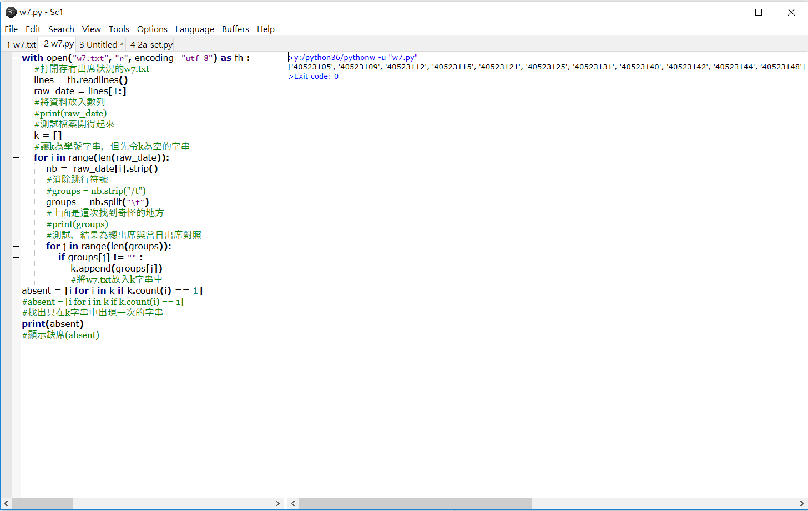

# w7缺席名單

#### 本周練習為自評依據

[練習範本](https://github.com/mdecourse/cd2018/issues/22)

##### 練習結果



##### 程式碼

```
with open("w7.txt", "r", encoding="utf-8") as fh :
#打開存有出席狀況的w7.txt
lines = fh.readlines()
raw_date = lines[1:]
#將資料放入數列
#print(raw_date)
#測試檔案開得起來
k = []
#讓k為學號字串，但先令k為空的字串
for i in range(len(raw_date)):
    nb =  raw_date[i].strip()
    #消除跳行符號
    #groups = nb.strip("/t")
    groups = nb.split("\t")
    #上面是這次找到奇怪的地方
    #print(groups)
    #測試，結果為總出席與當日出席對照
    for j in range(len(groups)):
        if groups[j] != "" :
            k.append(groups[j])
            #將w7.txt放入k字串中
absent = [i for i in k if k.count(i) == 1]
#absent = [i for i in k if k.count(i) == 1]
#找出只在k字串中出現一次的字串
print(absent)
#顯示缺席(absent)
```

#### 心得:

##### 這次的練習我看到了至少3種方法，第一種運用兩種名單差異找出缺席名單，第二種運用出席者會出現兩次的特性找出缺席者，第三種是40523119同學的方法，這方法很厲害，可惜的是我看完之後並無法運用。

##### 這次我用的是第二種方法，在此次程式的前面部分與這學期第一次練習一樣，先將名單導入，以及將跳行符號與跳格消除，比較不一樣的是:設定了k為空字串，這是為了後面將名單導入字串作的準備，接著將名單導入後，將名單內的字串為單一的找出來，並顯示，即完成了此次的練習。

#### 程式中單字或代號

##### utf-8\([wiki](https://zh.wikipedia.org/wiki/UTF-8)\)

##### strip\([翻譯](https://translate.google.com.tw/?hl=zh-TW#en/zh-TW/strip)\)

##### append\([翻譯](https://translate.google.com.tw/?hl=zh-TW#en/zh-TW/append)\)

##### absent\([翻譯](https://translate.google.com.tw/?hl=zh-TW#en/zh-TW/absent)\)


